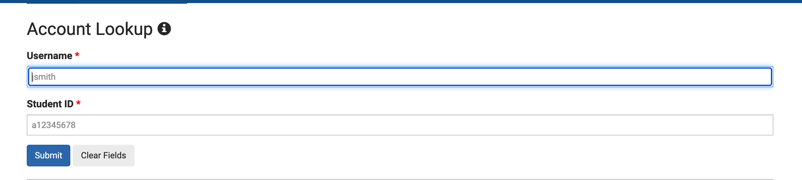
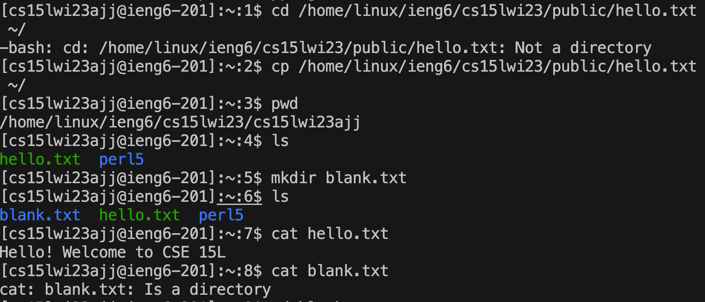

# CSE15L Lab1 Report
## Part1: Installing VScode
Visit the website [https://code.visualstudio.com/](https://code.visualstudio.com/). Click the dropdown menu to select and download the correct version based on your operating system. (See picture) 

A zip file should be downloaded to your computer once you click download. Open the folder and follow the instructions on the pop up screen for installation. 

## Part2: Remotely Connecting
Open. terminal in VScode and enter `ssh cs15lwi23zz@ieng6.ucsd.edu` in which zz are letters in your course-specific account. To find zz, please use the this link and enter your information for account lookup(refer to picture below) : [https://sdacs.ucsd.edu/~icc/index.php](https://sdacs.ucsd.edu/~icc/index.php)


1If it is the first time you tried to login, type in yes when the following message may appears: 
```
The authenticity of host 'ieng6.ucsd.edu (128.54.70.238)' can't be established.
RSA key fingerprint is SHA256:ksruYwhnYH+sySHnHAtLUHngrPEyZTDl/1x99wUQcec.
This key is not known by any other names
Are you sure you want to continue connecting (yes/no/[fingerprint])?
```
Then enter the your ucsd student account password and the terminal should give you something like the following message:
```
Attempting to create directory /home/linux/ieng6/cs15lwi23/cs15lwi23ajj/perl5
============================ NOTICE =================================
Authorized use of this system is limited to password-authenticated
usernames which are issued to individuals and are for the sole use of
the person to whom they are issued.

Privacy notice: be aware that computer files, electronic mail and 
accounts are not private in an absolute sense.  You are responsible
for adhering to the ETS Acceptable Use Policies, which you can review at:
https://blink.ucsd.edu/faculty/instruction/tech-guide/policies/ets-acceptable-use-policies.html
=====================================================================

*** Problems, Suggestions, or Feedback ***
    
    For help requests, please create a ticket at:
    https://support.ucsd.edu/its 

    You may also report issues, suggestions, or feedback by e-mailing root on any system:
    mail -s "Your subject here" root
    Type your message - Ctrl+D to send
    
*** Access our Linux ssh terminals or remote desktops via a web browser at: ***
    https://linuxcloud.ucsd.edu

    All accounts must be enrolled in Duo for access. No VPN required.


-------------------------------------------------------

Hello cs15lwi23ajj, you are currently logged into ieng6-201.ucsd.edu

You are using 0% CPU on this system

Cluster Status 
Hostname     Time    #Users  Load  Averages  
ieng6-201   14:35:01   13  0.07,  0.14,  0.13
ieng6-202   14:35:01   15  0.02,  0.12,  0.09
ieng6-203   14:35:02   13  0.13,  0.19,  0.15
```
## Part3: Trying Some Commands
Use this link to learn basic commands: 
[https://commonmark.org/help/](https://commonmark.org/help/)

I used `cd /home/linux/ieng6/cs15lwi23/public/hello.txt ~/` but there is an error because there is no such directory. I instead use cp to replace cd to copy that address. I used `pwd` to check  if I  am  in that directory and `ls` to check the files and folders in the current directory. I created a folder using `mkdir blank.txt` and printed the result in hello.txt using `cat hello.txt`. Then I tried the same thing on blank.txt. There is an error because it is a folder not a txt file despite the name. (refer to the picture below for specific codes)



