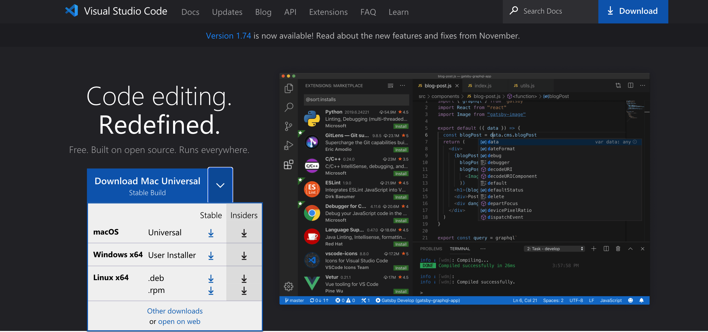

# CSE15L Lab1 Report
## Part1: Installing VScode
Visit the website [https://code.visualstudio.com/](https://code.visualstudio.com/). Click the dropdown menu to select and download the correct version based on your operating system. (See picture) 
A zip file should be downloaded to your computer once you click download. Open the folder and follow the instructions on the pop up screen for installation. 

## Part2: 
